# Shopping Billing Management

## Project Overview

This project is a Java console-based application designed for shopping and billing operations for a business. It has two main roles: Manager and Salesperson, each with specific privileges and responsibilities. The system utilizes JDBC for database connectivity, iText7 for PDF generation, and JavaMail for sending notifications. Maven is used for managing dependencies in this project.HTML CSS Vanila JavaScript for the front end
## Back-end
### Key Features

#### Login Page with Credential Evaluation:

1.Login as existing user
- Users should be able to input their credentials (username and password) on a login page.
- Once the credentials are submitted, the system should evaluate them against the records stored in the database and return the role based on which the workflow goes.

2. Register as a new user
- If a user is not registered yet, they can register as a new user
3.password Hashing and Database Security

- When a user registers  the system  hash the password before storing it in the database for security purposes
- In the event of a database compromise, hashed passwords are much safer than storing plaintext passwords because it's computationally difficult to reverse the hashing process and retrieve the original password.

#### Manager Role:

1. **Product Management**:
   - Add, edit, remove, and view products stored in the database.
   - Products are centrally managed in a database.
   - The removed products are not deleted from the database; rather, the flag is toggled to 'N' i.e., Soft Delete.
   
2. **Cart Management**:
   - Add products to the cart.
   - Proceed to billing based on the data in the cart.
   
3. **Billing**:
   - Generate bills from the items in the cart.
   - Upon confirmation, move the data to the transaction database for future management and history tracking.
   
4. **Low Stock Notification**:
   - Automatic email notifications are sent if the stock is low.
   
5. **History Management**:
   - View the profit made on a particular date.
   - View tax paid for a particular month.
   - View items sold along with the date.
   - View the products sold based on the mode of payment.
   - View tax paid for each product sold.

#### Salesperson Role:

1. **Product Management**:
   - Similar to the Manager, except for viewing products in the inventory.
   
2. **Cart Management**:
   - Add products to the cart for billing.
   
3. **Billing**:
   - Generate bills for customers based on items in the cart.

### Technology Stack

- **Java**: Core programming language for application logic.
- **JDBC (Java Database Connectivity)**: Connects to the database for CRUD operations.
- **iText7**: Generates PDF bills for customers.
- **JavaMail Activation**: Sends email notifications for low stock products.
- **Maven**: Dependency management for managing project dependencies.
- **MySQL**: To query the database

### Source Code Repository

- **GitHub Repository:** [Link to the GitHub repository](https://github.com/Murugappankrishna/Shopping_Billing_Management_Back_End_Final/tree/main)
- **To Get The File:** `git clone https://github.com/Murugappankrishna/Shopping_Billing_Management_Back_End_Final.git`

### Quick Start

1. Clone the repository to your local machine.
2. Locate the `SQL_Final.sql`and run it 
3. Navigate to the `JDBC.java` file located at `Back_End_Final/src/main/java/org/murugappan/repo/JDBC.java`and change the `username` and `password` as per your SQL DB credentials.
4. Navigate to the `App.java` file located at `Back_End_Final/src/main/java/org/murugappan/App.java`
5. Navigate to the `pom.xml` file located at `Back_End_Final/pom.xml`.
6. Update Maven to get the dependencies.
7. Compile and run `App.java` in your preferred IDE or in terminal use `javac App.java` then `java App` to run.

### File Structure

The project directory structure is organized as follows:

```
Solartis_Project-main/
│
└── src/
    └── main/
        └── java/
            └── org/
                └── murugappan/
                    ├── App.java
                    ├── DAO/
                    ├── model/
                    ├── service/
  ```

## File Structure Overview

- **DAO Layer**: Handles database interactions and closing connection with separate interfaces and implementations, adhering to the DAO pattern for better modularity and abstraction.
- **Model Layer**: Defines classes representing entities in the application using HashMaps for simplicity and flexibility.
- **Repo Layer**: Manages database connections and operations, encapsulating database-specific logic.
- **Service Layer**: Facilitates data retrieval and presentation to the console, abstracting database details from the application logic.
- **App.java**: Main class containing the main method, for the execution of the application.

## SQL - ER Diagram

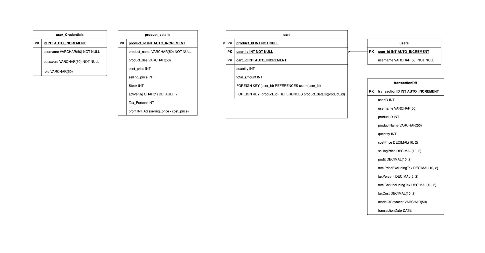

## SQL Database Schema

#### Tables:

1. **user_Credentials Table**:
   - Stores Manager and Salesperson data.

2. **product_details Table**:
   - Stores product details 
   - Indexing is applied for faster access to product data.

3. **users Table**:
   - Stores customer data.
   - Indexing is applied for faster access to product data.

4. **cart Table**:
   - Stores product details added by customers to their cart.
   - Contains columns such as cart ID, product ID, quantity, etc.

5. **transaction Table**:
   - Stores data of all successful transactions made.
   - Responsible for history management.

- Indexes are created on relevant columns in the product and user tables for faster data retrieval.
### ScreenShots 
- Login Screen
  

- Home Screen
  
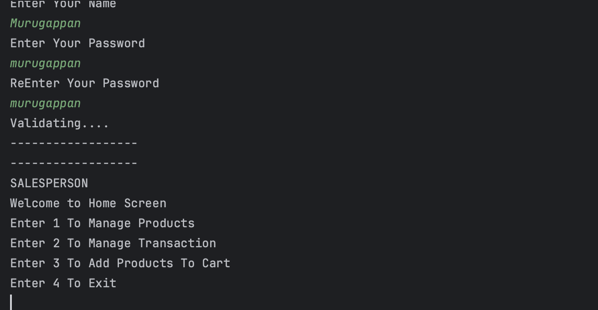
- Manage Products Screen
  

- Manage Transaction Screen
  
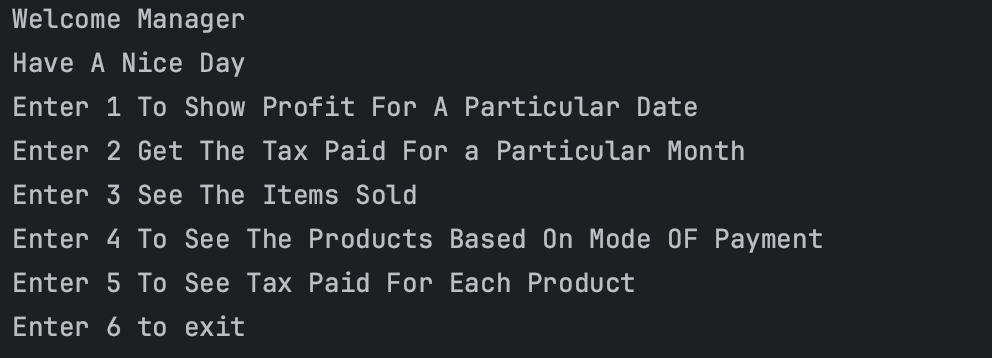
- Add Cart Screen
  


- Sample Bill Pdf
[Bill PDF](Readme-Screenshots/invoice.pdf).


## Front-End

### Key Features

1. **Product Management**: This system offers the capability to add, edit, and delete products from the inventory. Each product can be described with details such as ID, name, price, description, and image link.

2. **User-Friendly Interface**: With a responsive user interface, users can easily navigate through various functionalities including adding products to the cart and managing inventory.

3. **Responsive Design**: The design is optimized for different screen sizes, ensuring a seamless experience across various devices. This is achieved through the use of media queries in CSS.

4. **Data Persistence**: Utilizing local storage, the system ensures that user data, such as items added to the cart, remains intact even if the webpage is refreshed or closed temporarily.

5. **Null Field Validation**: JavaScript validation is implemented to ensure that all required fields are filled out before any product-related action is performed. This prevents unintended behavior and ensures data accuracy.

### Technologies Used

- **HTML/CSS**: The structure and styling of the web pages are implemented using HTML and CSS respectively. Responsive design is achieved through media queries in CSS.
  
- **JavaScript**: JavaScript is used for client-side validation, dynamic content manipulation, and interacting with local storage to persist user data.
  
- **Local Storage**: Local storage is employed to store user data such as product details and items added to the cart, ensuring data persistence across sessions.

### Live Demo and Website Deployment

- **Live Demo**: [Link to the deployed website](https://solartis-shoppingbilling-management.netlify.app/)
- **Deployment**: The following site is deployed using Netlify services.

### Source Code Repository

- **GitHub Repository:** [Link to the GitHub repository](https://github.com/Murugappankrishna/Shopping_Billing_Management_Front_End_Final)
- **To Get The File**: `git clone https://github.com/Murugappankrishna/Shopping_Billing_Management_Front_End_Final.git`

### Quick Start

1. Clone the repository to your local machine.
2. Navigate to the `login.html` file located at `Front_End_Final/login/login.html`

 ### File Structure
The project directory structure is organized as follows:

```
Shopping_Billing_Management_Front_End_Final/
│
├── home/
│   ├── homepage.css
│   └── homepage.html
│
├── login/
│   ├── login.css
│   └── login.html
│
├── Edit/
│   ├── edit.css
│   ├── edit.html
│   └── edit.js
│
├── add/
│   ├── add.css
│   ├── add.html
│   └── add.js
│
├── cart/
│   ├── cart.css
│   ├── cart.html
│   └── cart.js
│
├── delete/
│   ├── delete.css
│   ├── delete.html
│   └── delete.js
│
└── products.js
```

### User Interface/Features Screenshots
- Login Page
  

- Home Page
  
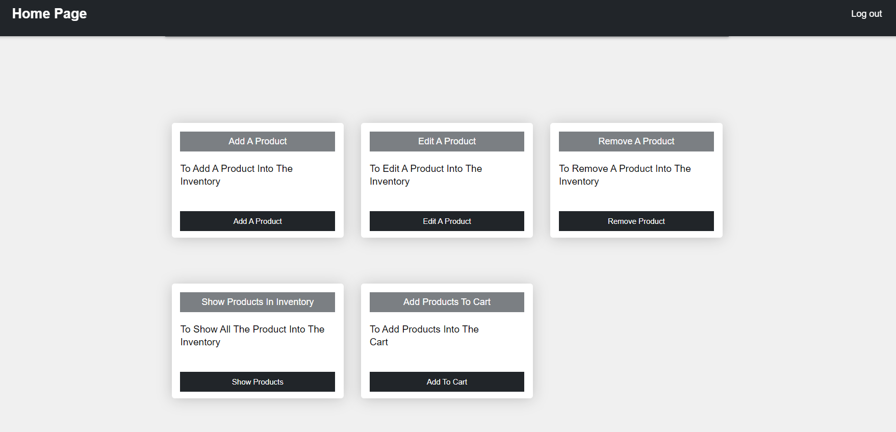

- Responsive Home Page
  
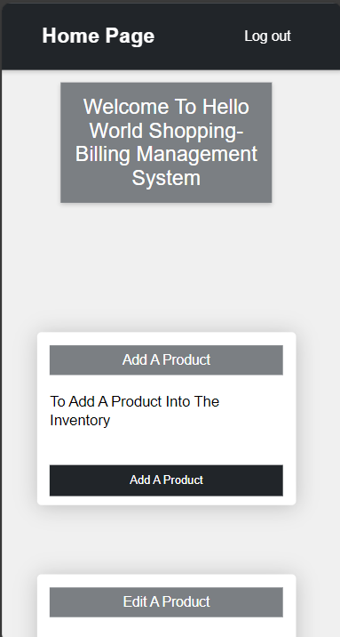

- Code Implementation
  
```
CSS
/* Media query for screen width up to 1000px */
@media (max-width: 1000px) {
  .container {
    grid-template-columns: repeat(2, 233px);
  }
}
```

```
CSS
/* Media query for screen width up to 500px */
@media (max-width: 500px) {
  .container {
    grid-template-columns: repeat(1, 233px);
  }
```
- Add Products Page
  
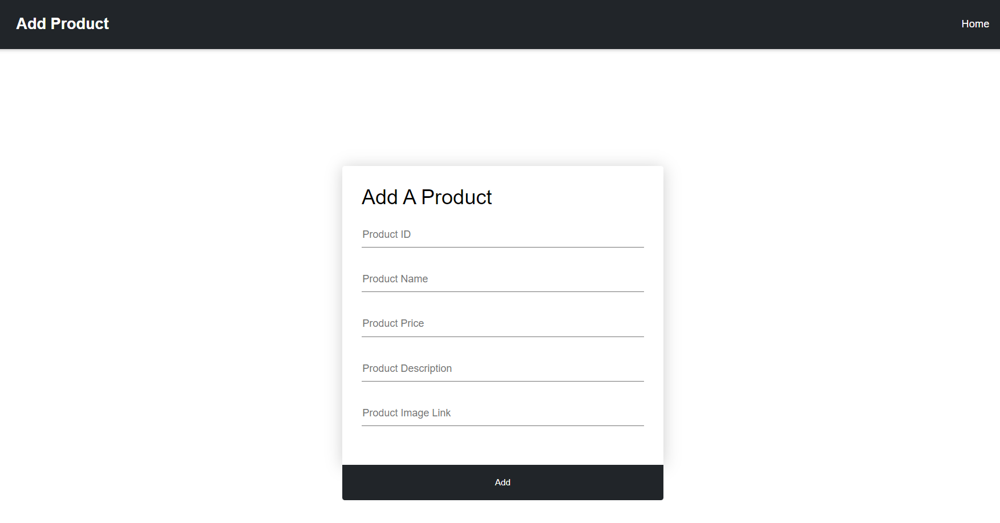
- Edit Products Page
  
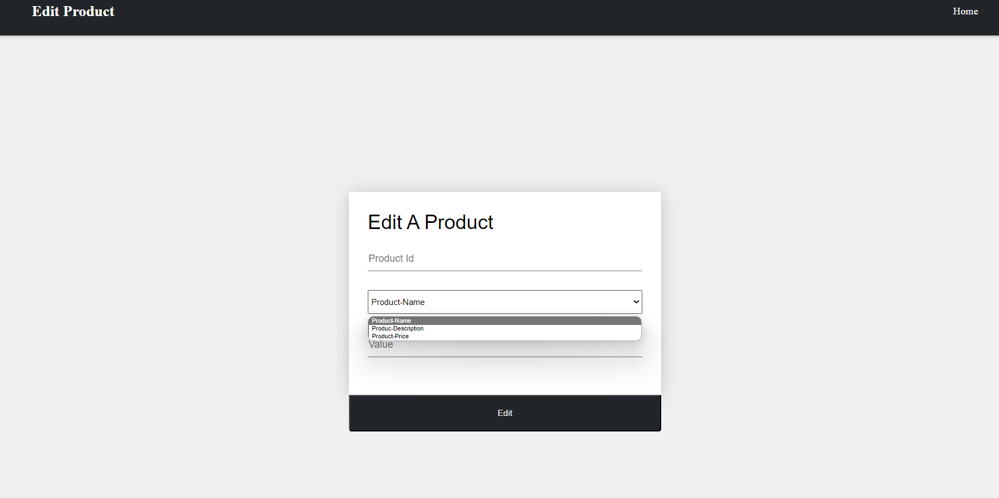
- Remove Product
  
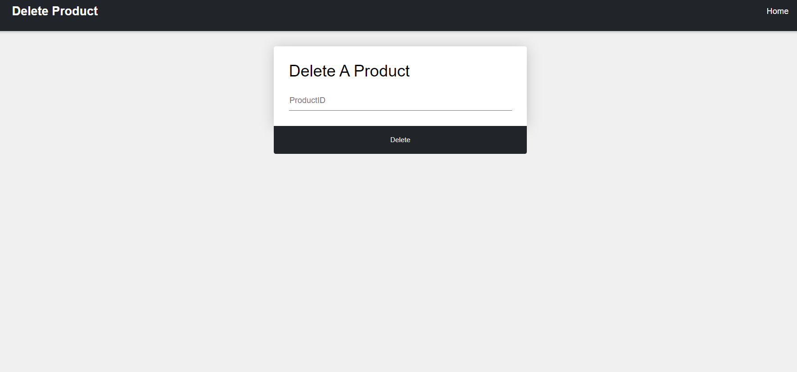
- View All Products
  
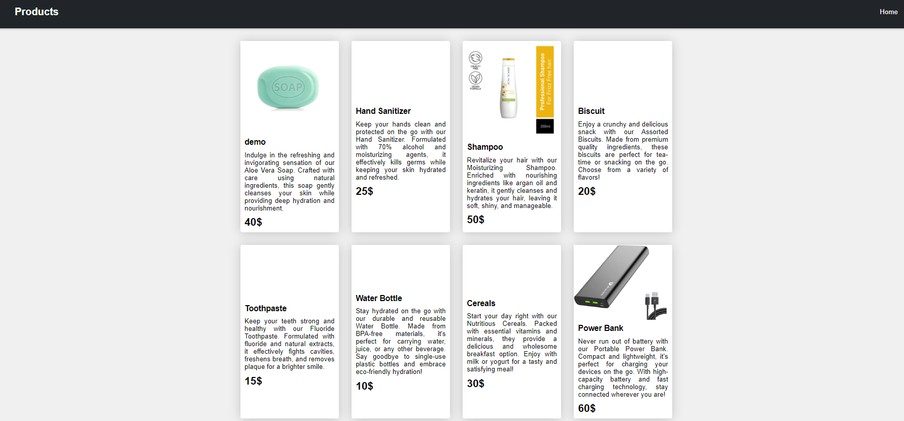
- Cart Page
  
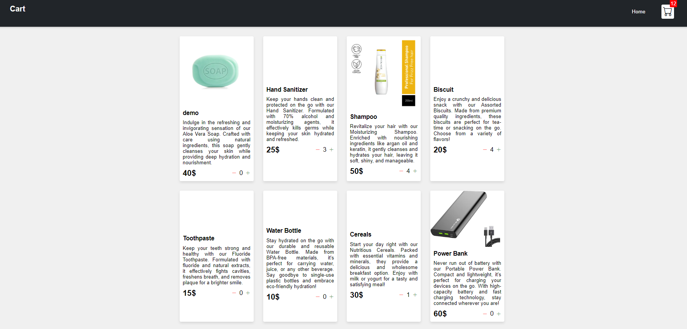
- Responsive Cart Page

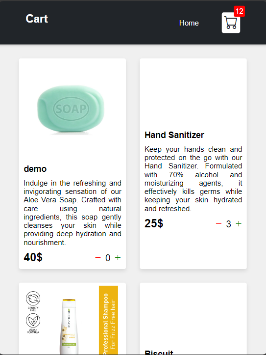
- Usage Of Local Storage
  


- Code Implementation
  
```
JavaScript
// Retrieve products from local storage
shopItems = JSON.parse(localStorage.getItem("products"));
```

```
JavaScript
// Set default products if local storage is empty
if (!localStorage.getItem("products")) {
  localStorage.setItem("products", JSON.stringify(shopItemsData));
}
```


